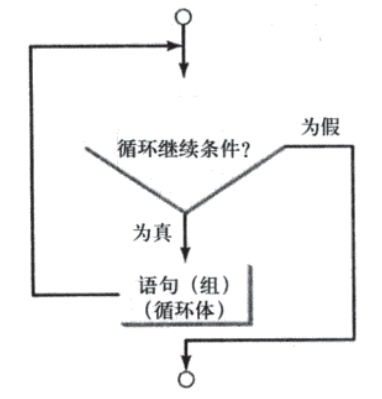
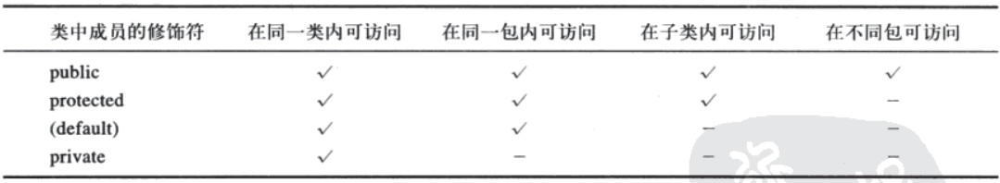
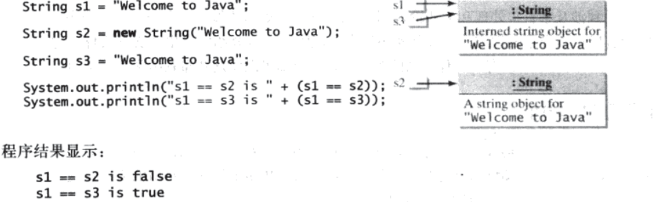

# Java概述

**软件：**

​		一系列按照特定顺序组织的计算机数据和指令的集合。

​		系统软件和应用软件都是用计算机语言编写出来的，计算机语言调用底层指令处理数据。

**中央处理器：**


​		计算机的大脑，由控制单元和算术/逻辑单元组成。

​		控制单元：用于控制和协调除CPU之外其他组件的动作。

​		算术/逻辑单元：用于完成数值运算(加法，减法，乘法，除法)和逻辑运算(比较)。

**内存：**

​		为了存储和处理信息，计算机利用电的两种状态：关和开，习惯上认为他们分别是0和1，CPU要执行的数据和程序指令都以一组比特或字节的形式储存在计

算机内存中，每个字节由8比特构成。内存单元是由字节构成的有序序列。

​		字节是最小的存储单元，为了存储一个单个字节放不下的大数字，计算机需要使用几个相邻的字节。任何两个数据都不能共享和分割同一个字节。

​		内存中字节的内容永远非空，但是它的原始内容可能对于你的程序来说是毫无意义的，一旦新的信息被放入内存字节，该字节的当前内容就会丢失。

​		程序及其所需数据必须在他们被执行前放入内存。

​		每个字节都有一个唯一的地址。使用这个地址确定字节的位置，以便于存储和获取数据。因为可以按任意顺序存取字节，所以内存也被称为随机访问存储器

(RAM)。

**存储设备：**

​		内存是不能长久保存数据的，因为断电时信息就会丢失。程序和数据都会被永久地存放在存储设备，当计算机确定要使用它们时再移入内存，因为从内存读取

比从存储设备读取要快得多。

**驱动器：**

​		对存储介质进行操作的设备。

**输入和输出设备：**

​		用户是通过输入设备和输出设备与计算机进行通信的。

​		输入设备：键盘和鼠标。

​		输出设备：显示器和打印机。

**程序：**

​		计算机程序通常称为软件，是发给计算机的指令，告诉计算机该做什么，因为计算机不理解人类的语言，所以，需要在计算机程序中使用计算机语言。程序设

计就是创建一个可以让计算机执行并完成所需任务的程序。

​		**汇编语言：**

​				一种低级的程序设计语言，它用助记符表示每一条机器语言指令。

​				汇编程序是用易于记忆的助记符形式的机器指令编写的，因为汇编语言具有机器依赖性，所以汇编程序只能在某种特定的机器上执行。为了解决克服平

​		台依赖性问题以及降低程序设计难度，开发了高级语言。

​		**高级语言：**


​				用高级语言编写的程序成为源程序或源代码。由于计算机不能理解源程序，所以，要使用称为编译器的程序将源程序翻译成机器语言程序。然后，这个

​		机器语言程序再与其他辅助的库代码进行链接，构成可执行文件，该文件就可以在机器上运行。


**操作系统：**

​		是运行在计算机上最重要的程序，他可以管理和控制计算机的活动。


​		多道程序设计允许多个程序通过共享CPU同时运行。CPU的速度比其他组件快得多，这样，多数时间它都处于空闲状态。多道程序设计操作系统利用这一特

点，允许多个程序同时使用CPU，一旦CPU空闲就让别的程序使用它。

​		多线程允许在一个程序内部进行并发处理，这样，程序的子任务就可以同时运行。

​		多处理也称为并行处理，是指使用两个或多个处理器共同完成同一个任务。

**控制台：**

​		指计算机的文本输入和显示设备。

**JRE：**

​		Java运行环境。包括Java虚拟机和Java程序所需要的核心类库，如果想要运行一个开发好的Java程序，计算机中只需要安装JRE即可。

**JDK：**

​		Java开发工具包。JDK是提供给Java开发人员使用的，其中包含了java的开发工具，也包括了JRE。所以安装了JDK，就不用再单独安装JRE了。其中的开发

工具有编译工具(javac.exe)，打包工具(jar.exe)等。


​		`编译`时，如果`没有语法错误`，编译器就会`生成一个扩展名为.class的字节码文件`。

​		Java语言是高级语言，而Java字节码是低级语言。`字节码类`似于机器指令，但它是体系结构中立的，是`可以在任何带Java虚拟机(JVM)的平台上运行的`。`虚拟`

`机(JVM)`不是物理机器，而`是一个解释Java字节码的程序`：Java字节码可以在不同的硬件平台和操作系统上运行。JVM的作用：搭建了Java语言编写的程序与操作

系统之间的桥梁。 

​		`执行Java程序`就是`运行程序的字节码`，可以在任何一个装有JVM的平台上运行字节码，`解释Java字节码`。解释的`过程即是一次将字节码中单独的一步翻译为`

`目标机器语言代码`，而`不是将整个程序翻译成单独的一块。翻译完一步之后就立即执行这一步`。


​		如果`执行一个不存在的类`，就会`出现NoClassDefFoundError的错误`。如果执行的`类中没有main方法或敲错了main方法`，则会`出现提示NoSuchMethodError`。

​		在`执行`一个Java程序时，JVM`首先会用一个称为类加载器的程序将类的字节码加载到内存中`。如果你的程序中使用其他类，类加载器程序会在需要它们之前

动态地加载它们。`当加载该类后，JVM使用一个称为字节码验证器的程序来验证字节码的合法性`，确保字节码不会违反Java的安全规范。

​		除非要在程序中使用某个类，否则关于`被导入包中的这些类的信息在编译是或运行时是不被读入的`。导入语句`只是告诉编译器在什么地方能找到这些类`。声明

明确导入和声明通配符导入在性能上是没有什么差别的。其中：java.lang包内的所有类在每个Java程序中都被隐式导入。

# 基础语法

​		Java语言`基础由关键字、标识符、注释、常量和变量、运算符、语句、函数、和数组等组成`。

## 关键字：

​		定义：被java语言赋予了特殊含义的单词。 

​		特点：关键字中所有字母都是小写。


​		字面量`true、false和null如同字面量100一样`，不是关键字，但是`它们也不能用作标识符`。

​		`strictfp`关键字是`方法或类的修饰符`，用于`限制浮点数计算`。浮点数运算可以在`两种模式(精确或非精确)`下执行。`精确模式保证`计算结果在所有java虚拟机实现

上保持一致`。`非精确模式允许中间计算结果以不同于IEEE浮点数格式的扩展格式保存`。扩展模式是机器相关的，并且能够使代码执行更快。但是，当使用非精确

模式在不同的JVM上执行时，可能不会得到相同的结果。`默认情况下，非精确模式用于浮点数计算`。如果要对方法和类使用精确模式，需要在类或者方法的声明前

面加上strictfp关键字。精确浮点数比非精确浮点数的精度更好，但这种差异只影响部分应用程序，精确性不能继承，也就是说，出现在类或接口上的strictfp不会使

扩展的类或接口同样精确。

**native：**

​		`native`关键字是`与C++联合开发的时候用的`。使用native关键字`说明这个方法是原生函数`，也就是这个方法`是用C/C++语言实现的`，并且`被编译成了DLL，由`

`Java去调用`。这些函数的`实现体在DLL中，JDK的源代码中并不包含`，你应该是看不到的。对于不同的平台它们也是不同的。这也是Java的底层机制，实际上Java就

是在不同的平台上调用不同的native方法实现对操作系统的访问的。

​		可以将`native`方法比作Java程序同Ｃ程序的接口，其实现步骤：

​				1、 在Java中声明native()方法，然后编译。

​				2、 用`Javah`产生一个.h文件。

​				3、 写一个`.cpp`文件实现`native`导出方法，其中需要包含第二步产生的.h文件（注意其中又包含了JDK带的jni.h文件）。

​				4、 将第三步的.cpp文件编译成动态链接库文件。

​				5、 在Java中用System.loadLibrary()方法加载第四步产生的动态链接库文件，这个native()方法就可以在Java中被访问了。

​		使用情况：

​				1、 为了使用底层的主机平台的某个特性，而这个特性不能通过JAVA API访问。

​				2、 为了访问一个老的系统或者使用一个已有的库，而这个系统或这个库不是用JAVA编写的。

​				3、 为了加快程序的性能，而将一段时间敏感的代码作为本地方法实现。

​		如果一个`含有`本地方法(`被native修饰的方法)的类被继承`，`子类会继承这个本地方法`并且可以用Java语言重写这个方法。


## 标识符：

​		定义：在程序中自定义的一些名称。

​		特点：由26各英文字母大小写。 

​		定义规范：JAVA中严格区分大小写

​				**由字母、数字、下划线(_)和美元符号($)构成的字符序列。**

​				**必须以字母、下划线或美元符号开头。**

​				**可以为任意长度。** 

​				**数字不可以做开头。**

​				**不可以使用关键字。**

​				**不可以包含 ”_$” 以外的特殊符号。**

命名规范：

​		**包名：多单词组成时所有字母都小写。**

​		**类名接口名：多单词组成时，所有单词的首字母大写。**

​		**变量名和函数名：多单词组成时，第一个单词首字母小写，第二个单词开始每个单词首字母大写。**

​		**常量名：所有字母都大写，多单词时每个单词用下划线连接。**


## 注释：

​		定义：用于注解说明解释程序的文字就是注释。

​		特点：提高了代码的阅读性。

​		格式：

​				单行注释：

```java
//注释文字
```

​				多行注释：

```java
/*注释文字*/
```

​				文档注释：

```java
/**注释文字*/
```

​		对于单行和多行注释，被注释的文字，不会被JVM解释运行。所以，添加再多的注释，编译后生成的class文件占用硬盘字节多少不变。

​		文档注释，是java特有的注释，其中解释内容可以被JDK提供的工具javadoc所解析，生成一套以网页文件形式体现的该程序的说明文档。

​		单行注释可以嵌套单行注释，单行注释也可以嵌套多行注释，多行注释可以嵌套单行注释。但是，多行注释不能嵌套多行注释，因为多行注释的开头会和被嵌

套的多行注释的结尾配对，导致后面的注释实效。

​		一个良好的习惯：**先写注释在写代码**。


## 常量：

​		不能改变的数值。

​		常量中的成员变量必须在同一条语句中声明和赋值。而局部变量可以不再同一条语句中声明和赋值，但只能被赋值一次。

分类：

​		整数常量：所有整数，

​		小数常量：所有小数，

​		布尔型常量：只有两个数值，true,false。

​		字符常量：将一个数字，字母或者符号用单引号(‘’)标识，

​		字符串常量：将一个或者多个字符用双引号(“”)标识，

​		Null常量：只有一个值就是：null。


## 进制：

​		二进制：0-1，满2进1。用0b开头表示。

​		八进制：0-7，满8进1，用0开头表示。

​		十进制：0-9，满10进1。

​		十六进制:0-9，A-F，满16进1，用0x开头表示。

​		任何数据在计算机中都是以二进制的形式存在的，二进制早期由电信号开关演变而来。一个整数在内存中一样也是二进制。

​		进制越大，表现形式越短。


## 变量：

​		定义：内存中的一个存储区域，该区域有自己的名称(变量名)和类型(数据类型)，该区域的数据可以在同一类型范围内不断变化。

​		特点：变量其实就是将不确定的数据进行存储，也就是需要在内存中开辟一个空间。

​		作用：用来不断地存放同一类型的常量，并可以重复使用。

​		格式：固定，

​		作用范围：一对{}之间有效，

​		只能存放某一类型的数据。

​		变量`声明：告知编译器根据数据类型为变量分配合适的存储空间`。

​		在赋值给变量之前，必须声明变量，方法中声明的变量(局部变量)在使用之前必须被赋值。任何时候，都要尽可能一步完成变量的声明和赋初值。这会使得程

序易读，同时避免程序设计错误。

​		要给一个变量赋值，变量名必须在赋值运算符的左边。


# 数据类型

​		Byte：1个字节，默认值：0

​		Short：2个字节，默认值：0

​		Int：4个字节，默认值：0

​		Long：8个字节，默认值：0L

​		Float：4个字节，默认值：0.0f

​		Double：8个字节，默认值：0.0d

​		Boolean：视编译环境而定。默认值：false

​		Char：2个字节。默认值：’\u0000’


​		整数默认类型：int

​		小数默认类型：double

​		double类型的小数精度比float类型的小数更高。

​		`引用数据类型变量占4个字节`。

​		由于`整数默认类型是int类型`，如果数值`超过了int类型的范围，即使是赋值给long类型的变量`，但是由于后面的`常量已经超过了int类型的范围，同样会报错`。

(解决方法：在数值`后面加上一个“L”`，就可以让编译器知道后面的常量是long类型)。

​		由于`小数默认是double类型，赋值给float`类型的变量，当然`可能会损失精度`，必然通`不过编译器的审核`。(解决方法：在数值`后面加上一个“f”`，让编译器知道

后面的常量是float类型的)。

​		当被赋值的变量的值太大(在大小方面)以至于无法存储时，就会造成上溢。但Java不会报关于上溢的警告或错误。

# 类型转换

​		两种：`自动类型转换`和`强制类型转换`

​				`自动类型转换`：又称`隐式类型转换`，就是不需要我们手动对类型来进行强制转换。

​				`强制类型转换`：又称`显式类型转换`，需要把类型进行手动转换，否则无法正常使用。

​		总是`可以将一个数值赋给支持更大数值范围类型的变量`。

​		类型转换是一种将一种数据类型的值转换成另一个数据类型的操作。`将一个小范围类型的变量转换为大范围类型的变量称为拓宽类型`，把`大范围类型的变量转换为`

`小范围类型的变量称为缩窄类型`。拓宽类型不需要显示转换，可以自动执行转换。`缩窄类型必须显示完成`。

**语法要求：**

​		要把`目标类型放在括号内`，紧跟其后的是要转换的变量名或值。

**运算结果：**

​		只有数值类型才能进行加减乘除，非数值类型不行。

​		所有的byte型，short型，char型的值将被提升到int型。

​		如果有一个操作数是long型，计算结果就是long型。

​		如果有一个操作数是float型，计算结果就是float型。

​		如果有一个操作数是double型，计算结果就是double型。

# 运算符：


​		整数与整数相除时，结果永远是整数，小数部分被忽略。为了实现通常意义的算术除法其中一个操作数必须是浮点数。

​		负数对正数取模结果为负数。

​		正数对负数取模结果为正数。

 

​		**b = a++**

​				执行时，计算机会把a放在一个临时内存空间中，然后将a自加1，再将临时内存空间中的a赋值给b，因此b还是原来的a的值。

​		b = ++a

​				执行时，先将a自加1，再将a赋值给b。

​		short s = 3; s += 4;

​				执行时，编译器在编译时，默认进行了强制类型转换，也就是将int类型的数据转换成short类型的数据。

​		s = s + 4;

​				执行时，编译器在编译的时候，默认并没有强制类型转换。 此时可能损失精度。


​		`i++ `与 `++i`：

​		若运算符是在变量的前面，则该变量自增1或自减1，然后返回的是变量的新值。

​		若运算符是在变量的后面，则变量也会自减1或自增1.但是返回的是变量原来的旧值。因此，前置的++x和--x分别称为前置自增运算符和前置自减运算符，而

后置x++和x---分别称为后置自增运算符或后置自减运算符。如果单独使用某种前置形式++(或--)和后置形式++(或--)那么不管前置还是后置其效果是一样的，但是用

在表达式中它们就会产生不同的效果。


​		涉及`浮点数的计算都是近似的`，因为这些数没有以准确的精度来存储。

​		整数可以精确地存储，因此，整数计算得到的是精确地整数运算结果。

​		`整数除以零`是非法的，会`抛出异常ArithmeticException`，但是浮点数除以零不会引起异常。在浮点数运算中，如果运算结果对double型或float型来说数值太

大。则向上溢出到无穷大；如果运算结果对double型或float型来说数值太小，则向下溢出到零。Java用特殊的浮点值POSITIVE_INFINITY、NEGATIVE_INFINITY

和NaN(not a number，非数)来表示这些结果。这些值被定义为Float类和Double类中的特殊常量。

​		如果正浮点数除以零，结果为POSITIVE_INFINITY，如果负浮点数除以零，结果为NEGATIVE_INFINITY，如果浮点数零除以零，结果为NaN，表示这个结

果在数学上是无定义的。这三个值得字符串表示为Infinity、-Infinity、NaN。

​		这些特殊值也可以在运算中用作操作数：


​		**如果一个操作数是NaN，则结果一定是NaN。**


加号（+）两种意义：

​		一：做加法。

​		二：做字符串的连接(此时 ’+’ 被称为字符串连接符)。如果两个操作符都是字符串，字符串连接符就把两个字符串连接起来。如果其中一个操作符非字符串，

这个非字符串就会先被转化为一个字符串，然后再与另一个字符串相连。(在源代码中，字符串常量不能换行)。

**比较运算符：**


​		比较运算符的结果都是boolean型，也就是要么是true，要么是false。

​		比较运算符“`==`”不能误写成“`=`”。

**逻辑运算符：**


​		逻辑运算符用于连接两个boolean类型的表达式。

​		“&”符号的运算规律：运算的两边只要有一个false，结果肯定是false。只有两边都为true，结果才是true。

​		“|”符号的运算规律：运算的两边只要有一个true，结果肯定是true。只有两边都为false，结果是false。

​		“^”符号的运算规律：运算的两边结果如果相同，结果是false。两边的结果不同，结果是true。

​		“!”：符号的运算规律：!true = false ; !false = true ; !!true = true;


​		“&&”：和“&”运算的结果是一样的，但是运算过程有点小区别。

​				&：无论左边的运算结果是什么，右边都参与运算。

​				&&：当左边为false时，右边不参加运算，这样可以提升效率。


​		“||”：和“|”运算的结果是一样的，但运算过程有点小区别。

​				|：无论左边的运算结果是什么，右边都参与运算。

​				||：当左边为true时，右边不参加运算，这样可以提升效率。

​		使用“&&”和“||”比使用“&”和“|”更高效一些。

​		一个布尔值不能转换为其他类型的值，其他类型的值也不能转换为布尔类型值。

**位运算符：**


​		位运算：直接对二进制位进行运算。

​		用“与运算”可以很方便提取某一二进制数的其中几位数。

​		`一个数异或同一个数两次`，结果`还是这个数`。

​		`取反`操作就是对二进制数值的每一位`0变1，1变0`。

​		`左移`几位其实就是该数据`乘以2的几次方`。

​		`右移`几位其实就是该数据`除以2的几次幂`。

​		对于`高位出现的空位，原来高位是什么，就用什么补这个空位`。

​		`无符号`右移，数据进行右移时，高位出现的空位，`无论原高位是什么，空位都用0补`。

**三元运算符：**

​		(条件表达式)`?`表达式1`:`表达式2；

​		如果条件为true，返回后的结果是表达式1；

​		如果条件为false，返回后的结果是表达式2；

​		表达式：就是具有一定语法规则的语句。

**直接量：**

​		程序中直接出现的常量值。

​		只要整形直接量与整形变量想匹配，就可以将整形直接量赋值给该整形变量。如果直接量太大，超过了该变量的存储范围，就会出现编译错误。

# 转义字符：


​		将一个整数转换成一个char型数据时，只用到该数据的低16位，其余部分都被忽略。

​		要将一个浮点值转换成char型时，首先将浮点值转换成int型，然后就将这个整形值转换成char型。

​		当一个char型数据转换成数值型时，这个字符的统一码就被转换成某个特定的数值。

**格式化控制台输出：**


# 条件分支

## **`if`语句**

单向`if`语句：

```java
if( 条件（布尔）表达式)
{
    执行语句;
}
```


​		如果`if`语句中`只有一条语句`，那么`可以不写大括号`。

​		若果`if`语句`没写大括号`，`if`就`只能控制离它最近的单条语句`。

双向`if`语句：

```java
if(条件表达式)
{
    执行语句;
}
else
{
    执行语句;
}
```


​		三元运算符就是`if else`语句简写格式。

多向`if`语句：

```java
if()
{
	执行语句;
}
else if()
{
    执行语句;
}
...
else
{
    执行语句;
}
```

特点：

​		每一个格式都是单条语句。

​		第二种格式与三元运算符的区别：三元运算符运算完一定要有值出现。好处是：可以写在其他表达式中。

​		条件表达式无论写成什么样子，只看最终的结果是`true`还是`false`。

常见错误：

​		忘记必要的括号。

​		在`if`出现错误的分号

​		对布尔值的冗余测试

​		悬空`else`出现的意义

## `Switch`语句：

```java
switch(表达式)
{
    case 取值1:
        执行语句;
        break;
    case 取值2:
        执行语句;
        break;
    case 取值3:
        执行语句;
        break;
    ....
    default:
        执行语句;
        break;
}
```

特点：

​		`switch`语句选择的类型只有四种：`byte,short,int,char`。

​		`case`与`default`没有顺序，先`执行第一个case`，`没有匹配的case`执行`default`。

​		结束`switch`语句的两种情况：遇到`break`，执行到`switch`语句结束。

​		如果匹配的`case`或者`default`没有对应的break，那么程序会继续向下执行，运行可以执行的语句，直到遇到`break`或者`switch`结尾结束。

​		进入`switch`语句后，执行顺序是`先执行case`，然后`从上到下`，`最后再执行default`，即使`default`放在`case`上面，执行顺序也不变。

`if`和`switch`语句的应用：

`if`：

​		对具体的值进行判断。

​		对区间判断。

​		对运算结果是boolean类型的表达式进行判断。

`switch`：

​		对具体的值进行判断。

​		值的个数通常是固定的。

​		对于几个固定的值判断，建议使用switch，因为switch语句会将具体的答案都加载进内存，效率相对高。

# 循环

## `while`语句：

```java
while(条件表达式)
{
    执行语句;
}
```



​		**不能在条件表达式的括号后面写分号**，写了会构成死循环。

​		在循环控制中，不要使用浮点值来比较值是否相等，因为浮点值都是某些值的近似值，使用他们可能导致不精确的循环次数和不准确的结果。

## `do while`语句：

```java
do
{
    执行语句;
}while(条件表达式);
```


`while`和`do  while`的区别：

​		`do  while`语句的特点：无论条件是否满足，循环体至少执行一次。

​		`while`如果条件不满足，循环体一次都不会执行。

## `for`语句：

```java
for(初始化表达式 ; 循环条件表达式 ; 循环后的操作表达式)
{
    执行语句;
}
```


​		三个表达式执行顺序：初始化表达式只执行一次，判断循环表达式，为真就执行循环体，然后再执行循环后的操作表达式，接着继续判断循环条件表达式，重

复这个过程，直到循环条件表达式为假为止。

​		初始化表达式，循环后的操作表达式可以是多个表达式，通过逗号分隔。

​		如果省略`for`循环中的循环继续条件，则隐含地认为循环条件为true。

​		`break`：在一个循环中使用`break`立即终止该循环。

​		`continue`：在循环中，`continue`会结束当前的迭代，程序控制转向该循环体的结尾。也就是跳出了一个迭代。

 

​		`while`和`for`可以互换，区别在于`for`为了循环而定义的变量在`for`循环结束就在内存中释放，而`while`循环使用的变量在循环结束后还可以继续使用。

# 方法

​		定义在类中的具有特定功能的一段独立的小程序。(创建可重用的代码) 是为完成一个操作而组合在一起的语句组。

```java
修饰符  返回值类型  函数名（参数类型 形式参数1 , 参数类型 形式参数2 , ...）
{
    执行语句（方法体）;
    return 返回值;
}
```


​		方法头：方法的修饰符，返回值类型，方法名和方法的参数。每一个参数都要进行独立的数据类型声明。

​		参数列表：指明方法中参数的类型，顺序和个数。

​		方法签名：方法名和参数列表。

​		方法体：定义方法做什么的语句集合。

​		返回值类型：函数运行后的结果的数据类型。如果方法有返回值，则称方法为带返回值得方法。

​		参数类型：是形式参数的数据类型。

​		形式参数：是一个变量，定义在方法头中的变量，用于存储调用函数时传递给函数的实际参数，简称形参。可选，方法可以不包含形参。没有形参时，在调用

和定义的时候方法名后面的一对圆括号是不能少的。

​		实际参数：传递给形式参数的具体数值，简称实参。

​		`return`：用于结束函数或返回方法执行的结果但同时也会结束函数执行。

​		返回值：该函数运算后的结果，该结果会返回给调用者。

​		返回值类型和参数类型没有直接关系。

**特点：**

​		定义函数可以将功能代码进行封装。

​		便于对该功能进行复用。

​		函数只有被调用才会被执行。

​		函数的出现提高了代码的复用性。

**调用：**


​		每当调用一个方法时，系统都会将参数，局部变量存储在一个称为堆栈的内存区域中，它用后进先出的方式存储数据。每当一个方法调用另一个方法时，调用

者的堆栈空间保持不动，新开辟的空间处理新方法的调用。一个方法结束返回到调用者时，其相应的空间也被释放。

​		调用方法时，提供的实参必须与方法签名中所对应的形参次序和数量相同，这称为参数顺序匹配。在类型上兼容(不需要经过显示的类型转换)。

​		当调用带参数的方法时，实参的值传递给形参，这个过程称为通过值传递。如果实参是变量而不是直接量，则将该变量的值传递给形参。无论形参在方法中是

否改变，该变量都不受影响。形参和实参是否同名是没有任何分别的。形参是方法中具有自己存储空间的变量。局部变量是在调用方法是分配的，当方法返回到调

用者后它就消失了。

​		对于基本数据类型参数，传递的是实参的值。

​		对于像数组这样的引用类型，参数值是实例的引用，给方法传递的是这个引用。即方法中的实例和传递的实例是一样的。如果在方法中对实例进行了修改，那

么在方法外的实例也会做同样的修改。

​		对于函数没有具体返回值的情况，返回值类型用关键字`void`表示，那么该函数中的`return`语句如果在最后一行可以省略不写，或者写上`return ;`  如果想

要终止方法并返回到方法的调用者，可以在相应的地方加上`return ;`。

​		对于带返回值的方法而言，`return`语句是必须的。

​		函数中只能调用函数，不可以在函数内部定义函数，否则，编译时期就会报错。

​		定义函数时，函数的结果应该返回给调用者，交由调用者处理。

​		如果方法返回一个值，对方法的调用通常就当作一个值处理。

​		如果方法没有返回值，对方法的调用必须是一条语句。

​		`main`方法由`Java`虚拟机调用。

 

​		**定义：指被定义的条目是什么。**

​		**声明：指为被声明的条目分配内存来存储数据。**

**重载：**

​		在同一个类中，允许存在一个以上的同名的函数，只要它们的参数个数或者参数类型不同即可。`Java`编译器根据方法签名决定使用哪个方法。

好处：

​		方便与阅读，优化了程序设计。

​		函数的功能一样，仅仅是参与运算的位置内容(形参)不同时，可以定义多函数，却使用统一函数名称，这样方便阅读，在调用时，虚拟机通过参数列表的不同

来区分同名函数。

​		被重载的方法必须具有不同的参数列表，不能基于不同修饰符或返回值类型来重载方法。

​		有时调用一个方法时，会有两个或更多可能的匹配，但是，编译器无法判断哪个是最精确的匹配，这称为歧义调用，会产生一个编译错误。

**变量作用域：**

​		指变量可以在程序中引用的范围，在方法中定义的变量称为局部变量。

​		局部变量的作用域从声明变量的地方开始，直到包含该变量的块结束为止。局部变量都必须在使用之前进行声明和赋值。

​		形参实际上就是一个局部变量，一个方法的形参的作用域涵盖整个方法。

​		`for`循环头中初始动作部分声明的变量，其作用域是整个for循环。但是在for循环体内声明的变量，其作用域只限于循环体内，是从它的声明处开始，到包含

该变量的块结束为止。


​		可以在一个方法中的不同块里声明同名的局部变量，但是，不能再嵌套块中或同一块中两次声明同一局部变量。

​		不要在块内声明一个变量然后企图在块外使用它，这样会产生一个语法错误，因为块内声明的变量在块外不可见。

# 数组

​		同一种类型数据的集合(用来存储数据的集合)，其实，数组就是一个容器。

**好处：**

​		可以自动给数组中的元素从0开始编号，方便操作这些元素。

```java
元素类型[] 数组名 = new 元素类型[元素个数或数组长度];
元素类型[] 数组名 = new 元素类型[]{元素1,元素2...};
元素类型[] 数组名 = {元素1,元素2....};
```

**内存分配：**


​		`Java`程序在运行时，需要在内存中分配空间，为了提高运算效率，又对空间进行了不同区域的划分，因为每一片区域都有特定的处理数据方式和内存管理方

式。

​		`JVM`将数组存储在一个称作堆的内存区域中，堆用于动态内存分配，在堆中内存块可以按随意的顺序分配和释放。

​		直接打印数组的引用变量，打印出来的结果是数组初始地址的哈希值。

​		数组中的所有元素都必须具有相同的数据类型。

​		声明一个数组变量时并不在内存中给数组分配任何空间，它只是创建一个对数组的引用的存储位置，如果变量不包含对数组的引用，那么这个变量的值为

`null`。除非数组已经被创建，否则不能给它分配任何元素。

​		一个数组变量看起来似乎是存储了一个数组，但实际上它存储的是指向数组的引用。

​		当给数组分配空间时，必须通过指定该数组能够存储的元素个数来确定数组大小，创建数组之后就不能再修改它的大小，可以是`arrayRefVar.length`求得数

组的大小。

​		当创建数组后，它的元素被赋予默认值，数值型基本数据类型的默认值是`0`，`char`型的默认值为`’\u0000’`，`boolean`型的默认值是`false`。

​		数组元素可以通过下标访问。数组下标是基于0的，也就是说，其范围从`0`开始到`arrayRefVar.length-1`结束。

​		可以使用赋值语句复制基本数据类型的变量，但不能复制数组。将一个数组变量赋值给另一个数组变量，实际上是将一个数组的引用复制给另一个变量，是两

个变量都指向相同的内存地址。


## 可变长参数列表：

​		在方法声明中，指定类型后紧跟着省略号`...`。指能给方法中指定一个可变长参数，同时该参数必须是最后一个参数，任何常规参数必须在它之前。

​		`Java`将可变长参数当成数组对待。可以将一个数组或可变的参数个数传递给可变长参数。当用可变的参数个数调用方法时，`Java`会创建一个数组并把参数

传给它。


**复制**

​		1、使用循环语句逐个地复制数组的元素。

​		2、使用System类中的静态方法arraycopy。

​		3、使用clone方法复制数组。

**遍历**

简单遍历：

```java
for(elementType element : arrayRefVar)
{
    
}
```

**内存的划分：**

​		1、寄存器

​		2、本地方法区

​		3、方法区

​		4、栈内存

​		5、堆内存


栈内存：

​		用于存储局部变量，当变量所属的作用域一旦结束，所占空间会自动释放。

堆内存：

​		数组和对象，通过new建立的实例都存放在堆内存中。

​		每一个实体都有内存地址值。实体中的变量都有默认初始化值，根据类型的不同而不同，整数类型是`0`，小数类型是`0.0`或`0.0f`，`boolean`类型是

`false`，`char`类型是`’\u0000’`。

​		如果将数组的引用实体设置为`null`，也就是实体不再被使用，那么会在不确定的时间内被垃圾回收器回收。

常见异常：

​		数据下标越界异常(`ArrayIndexOutOfBoundsException`)：访问到了数组中的不存在的下标时发生。

​		空指针异常(`NullPointException`)：当引用型变量没有指向任何实体是，用其操作实体，就会发生异常。

常见操作：

​		对数组操作最基本的动作就是存和取。核心思想是对下标的操作。

# 拷贝

## 浅拷贝

​		被复制对象的所有变量都含有与原来的对象相同的值，而所有的对其他对象的引用仍然指向原来的对象。即对象的浅拷贝会对“主”对象进行拷贝，但不会复制

主对象里面的对象。”里面的对象“会在原来的对象和它的副本之间共享。

```java
public class ShallowClone
{

    public static void main(String[] args) throws Exception
    {
        Teacher teacher = new Teacher(10,"老师1");
        Student student = new Student(1,"小杉杉",teacher);

        Student clone = (Student) student.clone();

        System.out.println("拷贝后============================");
        System.out.println(student == clone);
        System.out.println(student.toString());
        System.out.println(clone.toString());


        System.out.println("\n" + student.getTeacher().toString());
        System.out.println(clone.getTeacher().toString());


        teacher.setName("拷贝老师");
        System.out.println("\n修改老师的信息后=============");

        System.out.println(student.getTeacher().toString());
        System.out.println(clone.getTeacher().toString());


    }
}

class Student implements Cloneable
{
    private Integer id;
    private String name;

    private Teacher teacher;

    public Student(Integer id, String name, Teacher teacher) {
        this.id = id;
        this.name = name;
        this.teacher = teacher;
    }

    public Integer getId() {
        return id;
    }

    public void setId(Integer id) {
        this.id = id;
    }

    public String getName() {
        return name;
    }

    public void setName(String name) {
        this.name = name;
    }

    @Override
    protected Object clone() throws CloneNotSupportedException {
        return super.clone();
    }

    public Teacher getTeacher() {
        return teacher;
    }

    public void setTeacher(Teacher teacher) {
        this.teacher = teacher;
    }

    @Override
    public String toString() {
        return "Student{" +
                "id=" + id +
                ", name='" + name + '\'' +
                ", teacher=" + teacher +
                '}';
    }
}

class Teacher implements Cloneable
{
    private Integer id;
    private String name;

    public Teacher(Integer id, String name) {
        this.id = id;
        this.name = name;
    }

    public Integer getId() {
        return id;
    }

    public void setId(Integer id) {
        this.id = id;
    }

    public String getName() {
        return name;
    }

    public void setName(String name) {
        this.name = name;
    }

    @Override
    public String toString() {
        return "Teacher{" +
                "id=" + id +
                ", name='" + name + '\'' +
                '}';
    }
}
```


## 深拷贝

​		深拷贝是一个整个独立的对象拷贝，深拷贝会拷贝所有的属性,并拷贝属性指向的动态分配的内存。当对象和它所引用的对象一起拷贝时即发生深拷贝。深拷

贝相比于浅拷贝速度较慢并且花销较大。

```java
public class DeepClone
{

    public static void main(String[] args) throws Exception
    {
        Teacher teacher = new Teacher(10,"老师1");
        Student student = new Student(1,"小杉杉",teacher);

        Student clone = (Student) student.clone();

        System.out.println("拷贝后============================");
        System.out.println(student == clone);
        System.out.println(student.toString());
        System.out.println(clone.toString());


        System.out.println("\n" + student.getTeacher().toString());
        System.out.println(clone.getTeacher().toString());


        teacher.setName("拷贝老师");
        System.out.println("\n修改老师的信息后=============");

        System.out.println(student.getTeacher().toString());
        System.out.println(clone.getTeacher().toString());


    }
}

class Student implements Cloneable
{
    private Integer id;
    private String name;

    private Teacher teacher;

    public Student(Integer id, String name, Teacher teacher) {
        this.id = id;
        this.name = name;
        this.teacher = teacher;
    }

    public Integer getId() {
        return id;
    }

    public void setId(Integer id) {
        this.id = id;
    }

    public String getName() {
        return name;
    }

    public void setName(String name) {
        this.name = name;
    }

    @Override
    protected Object clone() throws CloneNotSupportedException {
        Student student = (Student) super.clone();
        Teacher teacher = (Teacher) student.getTeacher().clone();
        student.setTeacher(teacher);
        return student;
    }

    public Teacher getTeacher() {
        return teacher;
    }

    public void setTeacher(Teacher teacher) {
        this.teacher = teacher;
    }

    @Override
    public String toString() {
        return "Student{" +
                "id=" + id +
                ", name='" + name + '\'' +
                ", teacher=" + teacher +
                '}';
    }
}

class Teacher implements Cloneable
{
    private Integer id;
    private String name;

    public Teacher(Integer id, String name) {
        this.id = id;
        this.name = name;
    }

    public Integer getId() {
        return id;
    }

    public void setId(Integer id) {
        this.id = id;
    }

    public String getName() {
        return name;
    }

    public void setName(String name) {
        this.name = name;
    }

    @Override
    public String toString() {
        return "Teacher{" +
                "id=" + id +
                ", name='" + name + '\'' +
                '}';
    }

    @Override
    protected Object clone() throws CloneNotSupportedException {
        return super.clone();
    }
}
```

# 二维数组

```java
数据类型[][] 数组名 = new 数据类型[][];
```

​		二维数组中使用两个下标，一个表示行，另一个表示列。同一维数组一样，每个下标索引都是从`0`开始。

​		二维数组实际上是一个数组，它的每个元素都是一个一维数组。数组`x`的长度就是数组中元素的个数，可以用`x.length`获取该值。`x[length-1]`也是数组，

可以用`x[x.length-1].length`来获取他们的长度。

​		二维数组中的每一个行本身就是一个数组，因此，各行的长度就可以不同。这样的数组称为锯齿数组。


​		在创建数组时，必须指定第一个下标。

# 类和对象

面向过程：

​		强调的是功能行为。代表语言：C语言。

面向对象：

​		面向对象是相对面向过程而言，面向对象和面向过程都是一种思想。 将功能封装进对象，强调具备了功能的对象。代表语言：Java，C++，C#。

**特点：**

​		是一种符合人们思考的方式，可以将复杂的事情简单化，将程序员从执行者转换成了指挥者。

开发过程：

​		其实就是不断地创建对象，使用对象，使用对象做事情。

设计的过程：

​		其实就是在管理和维护对象之间的关系。

面向对象的的**特征**：

​		**继承**

​		**封装**

​		**多态**

​		**抽象**

对象与类之间的关系：

​		`Java`中描述事物通过类的形式体现，类是具体事物的抽象，概念上的定义。对象即是该类事物实实在在的个体。可以理解为：类就是图纸，汽车就是堆内存

中的对象。

## 类

​		用来定义同一类型的对象，类是一个模版、蓝本或者说是合约，用来定义对象的数据域是什么以及方法是做什么的。

​		一个类基本上等同于一个程序员定义的类型，一个类就是一种引用类型，这意味着任何类型为类的变量都可以引用该类的一个实例。

​		生活中描述事物无非就是描述事物的属性和行为。

​		Java中用类`class`来描述事物也是如此：

​				属性：对应类中的成员变量。

​				行为：对应类中的成员函数。

​		定义类其实就是定于类中的成员(成员变量和成员函数)。


类的抽象和封装：

​		类抽象：将类的实现和使用分离。

​		类的合约：类的创建者提供类的描述，让使用者明白如何才能使用类，从类外可以访问到全部方法和数据域，以及期望这些成员如何行动的描述。

​		类的封装：类的使用者不需要知道类是如何实现的，实现的细节经过封装，对用户隐藏。

对象的组合：

​		组合：一个对象可以包含另一个对象。是聚集关系的一种特殊形式。

​		聚集模拟了具有(has - a)关系，表示两个对象之间的归属关系。

​		归属关系中的所有者对象称为聚集对象，而它的类称为聚集类。

​		归属关系中的从属对象称为被聚集对象，而它的类称为被聚集类。

​		一个对象可以被几个其他聚集对象所拥有。如果一个对象只归属于一个聚集对象，那么它和聚集对象之间的关系就称为组合。

 

类的设计原则：

**内聚性：**

​		类应该描述一个单一的实体，而所有的类的操作应该在逻辑上相互配合，支持一个连贯性的目标。如果一个实体担负太多的职责，就应该按各自的职责分成几

个类。


**一致性：**

​		遵循标准`Java`程序设计风格和命名习惯，给类，数据域和方法选择有信息量的名字。流行的风格是将数据声明置于构造方法之前，并且将构造方法置于方法

之前。

​		选择名字要保持一致，给类似的操作选择不同的名字并非好的习惯。

​		应该一律提供一个为构造默认实例的公共无参构造方法。如果一个类不支持无参构造方法，要用文档写出原因。如果没有显式定义构造方法，就假定有一个空

方法体的公共默认无参构造方法。

​		如果不想让用户创建类的对象，可以在类中声明一个私有的构造方法。 

**封装性：**

​		一个类应该使用`private`修饰符隐藏其数据，以免用户直接访问它。这使得类更易于维护。如果想让数据域可读，只需提供`get`方法，如果想让数据域可更

新，应该提供`set`方法。

**清晰性：**

​		为使设计清晰，内聚性，一致性和封装性都是很好的设计原则。除此之外，类应该有一个很清晰的合约，易于解释和理解。

​		用户可以以多种不同组合和顺序，在许多不同的环境中结合多个类。因此，应该设计一个类，这个类应该没有对用户使用目的及使用时间的限制，设计属性以

容许用户按值得任何顺序和任何组合来设置所设计的方法实现的功能应该与他们出现的顺序无关。

​		方法应在不产生混淆的情况下凭直觉来定义。不应该声明一个来自其他数据域的数据域。

**完整性：**

​		类经常是为许多不同用户的使用而设计的，为了能在一个广泛的应用中使用，一个类应该通过属性和方法提供多种方案以适应用户的不同需求。

 

**实例和静态：**

​		依赖于类的具体实例或方法应该是一个实例变量或方法。如果一个变量被类的所有实例所共享，那就应该将它声明为静态的。

​		经常用类名(而不是变量名)引用静态变量和方法，以增加可读性并避免错误。

​		不要用构造方法中传入参数来初始化静态数据域。最好**使用`set`方法改变静态数据域。**

​		实例和静态是面向对象程序设计不可或缺的部分。数据域或方法要不是实例的就是静态的。不要错误地忽视了静态数据域或方法。常见的数据错误是将本应该

声明为静态方法的方法声明为实例方法。

​		构造方法永远都是实例方法，因为它是用来创建具体实例的。一个静态变量或方法可以从实例方法中调用，但是不能从静态方法中调用实例变量或方法。


## 对象

​		一个对象是类的一个实例，可以从一个类中创建多个实例，创建实例的过程称为实例化。

​		代表现实世界中可以明确标识的一个实体，每个对象都有自己独特的标识，状态和行为。是通过对象引用变量来访问的，该变量包含对对象的引用。

​		一个对象的状态是指那些具有他们当前值的数据域。

​		一个对象的行为由方法定义的，调用对象的一个方法就是要求对象完成一个动作。


​		`Java`类使用变量定义数据域，使用方法定义动作。除此之外，类还提供了一种称为构造方法的特殊类型的方法，调用它可以创建一个新对象。

​		构造方法本身是可以完成任何动作的，但是设计构造方法的初衷还是为了完成初始化操作。

​		从表面上看。对象引用变量中似乎存放了一个对象，但事实上，它只是包括了对该对象的引用，严格地讲，对象引用变量和对象是不同的，但是大多数情况

下，这种差异是可以忽略的。


​		通常，创建一个对象后，它的内容是允许随后改变的。有时候，也需要创建一个一旦创建，其内容就不能再改变的对象，我们称这种对象为一个不可变对象，

而它的类就称为不可变类。

​		如果一个类是不可变的，那么它的所有数据域必须都是私有的，而且没有对任何一个数据域提供公共的`set`方法，一个类的所有数据都是私有的且没有修改

器，并不意味着它一定是不可变类。

要使一个类称为不可变得，它必须满足：

​		1、所有数据域都是私有的。

​		2、没有修改器方法。

​		3、没有一个访问器方法，它会返回一个指向可变数据域的引用。


### 构造方法：

特殊性：

​		1、构造方法必须具备和所在类相同的名字。

​		2、构造方法没有返回类型，甚至连`void`也没有。

​		3、构造方法是在创建一个对象使用`new`操作符时调用的，构造方法的作用是初始化对象。

​		构造方法具有和定义它的类完全相同的名字，和所有其他方法一样，构造方法也可以重载，这样更易于用不同的初始数据来构造对象。

​		一个类可以不定义构造方法，在这种情况下，类中隐含定义一个方法体为空的无参构造方法。这个构造方法称为默认构造方法，当且仅当类中没有明确定义任

何构造方法时才会自动提供它。 

​		在创建一个对象之后，它的数据和方法可以使用原点运算符(`.`)来访问和调用，该运算符也称为对象成员访问运算符。

​		`objectRefVar.dataField`引用对象的数据域。数据域也可能是引用型的。

​		`objectRefVar.method(参数)`调用对象的方法。

**赋值顺序：**

​		1、父类的静态变量赋值。

​		2、自身的静态变量赋值。

​		3、父类成员变量赋值和父类块赋值。

​		4、父类构造函数赋值。

​		5、自身成员变量赋值和自身块赋值。

​		6、自身构造函数赋值。

成员变量和局部变量的区别：

成员变量：

​		1、成员变量定义在类中，对整个类都可以被访问。

​		2、成员变量随着对象的建立而建立，随着对象的消失而消失，存在于对象所在的堆内存中。

​		3、成员变量有默认初始化值。

局部变量：

​		1、局部变量只定义于局部范围内。

​		2、局部变量存在于栈内存中，作用的范围结束，变量空间会自动释放。

​		3、局部变量没有默认初始化值。


​		Java不会给方法中的局部变量赋默认值。

​		只要是用`new`操作符定义的实体就会在堆内存中开辟一个新的空间，而且每一个对象中都有一份属于自己的属性。

​		通过`对象.对象成员`的凡是操作对象中的成员，对其中一个对象的成员进行了修改，和另一个对象没有任何关系。

### 匿名对象

​		匿名对象是对象的简化形式。

​		匿名对象两种使用情况：

​				1、当对对象方法仅进行一次调用时。

​				2、匿名对象可以作为实际参数进行传递。

​		在`Java`中，方法参数的传递永远都是传值，而这个值，对于基本数据类型，值就是你赋给变量的那个值，而对于引用数据类型，这个值是对象的引用，而不

是这个对象本身。


基本类型变量和引用类型变量的区别：

​		每一个变量都代表一个存储值的内存位置。声明一个变量时，就是在告诉编译器这个变量可以存放什么类型的值。对基本类型变量来说，对应内存所存储的值

是基本类型值，对引用类型变量来说，对应内存中存储的值是一个引用，是对象的存储地址。

​		将一个变量赋值给另一个变量时，另一个变量就被赋了同样的值。对基本类型变量而言，就是将一个变量的实际值赋给另一个变量。对引用类型变量而言，就

是将一个变量的引用赋给另一个变量。

​		如果你认为不在需要某个对象，可以显示地给该对象的引用变量赋`null`值，如果该对象没有被任何引用变量所引用，`Java`虚拟机将自动回收它所占的空

间。


实例变量

​		是绑定到类的某个特定实例的，它是不能被同一个类的不同对象所共享的。

​		实例方法和实例数据都是属于实例的，所以他们在实例创建之后才能使用。它们是通过引用变量来访问的。

静态变量：

​		如果想让一个类的所有实例共享数据，就要使用静态变量，也称之为类变量。静态变量将变量值存储在一个公共的内存地址。因为它是公共的地址，所以如果

某一个对象修改了静态变量的值，那么同一个类的所有对象都会受到影响。`Java`支持静态方法和静态变量，无须创建类的实例就可以调用静态方法。

​		

​		一个类的实例变量和静态变量称为类变量或数据域。在方法内部定义的变量称为局部变量。不管在何处声明，类变量的作用域都是整个类，类的变量和方法可

以在类中以任意顺序出现。但是，当一个数据域是基于另一个数据域的引用来进行初始化的情况例外，在这种情况下，必须首先声明另一个数据域。

​		类变量只能声明一次，但是在一个方法内不同的非嵌套块中，可以多次声明相同的变量名。如果一个局部变量和一个类变量具有相同的名字，那么局部变量优

先，而同名的类变量将被隐藏。

​		为了避免混淆和错误，除了方法中的参数，不要将实例变量或静态变量的名字作为局部变量名。

### `this`

​		关键字`this`是指向调用对象本身的引用名或调用方法的对象，一种常见的用法就是引用类的隐藏数据域：

​		在数据域的`set`方法中，经常将数据域名用作参数名。在这种情况下，这个数据域在`set`方法中被隐藏。为了给它设置新值，需要在方法中引用隐藏的数据

域名。隐藏的静态变量可以简单地通过`"类名.静态变量"`的方式引用。隐藏的实例变量就需要使用关键字`this`来引用。

​		关键字`this`的另一个常用的方法是让构造方法调用同一个类的另一个构造方法。此时，`this`语句应在其他语句之前出现。

​		如果一个类有多个构造方法，最好尽可能使用`this(参数列表)`实现它们。通常，无参数或参数少的构造方法可以用`this(参数表)`调用参数多的构造方法，这

样做通常可以简化代码，是类易于阅读和维护。


​		要声明一个静态变量或定义一个静态方法，就要在这个变量或方法的声明中加上修饰符`static`。

​		静态方法和静态数据可以通过引用变量或它们的类名来调用。

 

​		属于实例的实例变量存储在互不相关的内存中，静态变量是被同一个类的所有实例所共享的。

​		静态变量和静态方法既可以在类的实例方法中使用，也可以在类的静态方法中使用，但是，实例变量和实例方法只能在实例方法中使用，不能再静态方法中使

用，因为静态变量和静态方法不属于某个特定的对象。

 

如何判断一个变量或方法应该是实例的还是静态的？

​		如果一个变量或方法依赖于类的某个具体实例，那就应该将它定义为实例变量或实例方法。

​		如果一个变量或方法不依赖于类的某个具体实例，那就应该将它定义为静态变量或静态方法。

 

可见性修饰符：

​		可以在类、方法和数据域前使用`public`修饰符，表示他们可以被任何其他的类访问。如果没有使用可见性修饰符，那么默认为类、方法和数据域是可以被同

一个包中的任何一个类访问的。这称作包私有或包内访问。

​		如果一个类没有被定义为公共的，那么它只能在同一个包内被访问。

​		包可以用来组织类。为了完成这个目标，需要在程序中首先出现如下语句，在这行语句之前不能有注释也不能有空白。

```java
package  packageName;
```


​		如果定义类时没有声明包，就表示把它放在默认包中。

 

`private`修饰符：

​		`private`修饰符限定方法和数据域只能在它自己的类中被访问。

​		

​		可见性修饰符指明类中的数据域和方法是否能从该类之外被访问。在该类之内，对数据域和方法的访问时没有任何限制的。

​		如果一个对象是在它自己的类中定义的，那么这个对象可以访问它的私有成员。

​		修饰符`private`只能应用在类的成员上。修饰符`public`可以应用在类或类的成员上。在局部变量上使用修饰符`public`和`private`都会导致编译错误。

​		大多数情况下，构造方法应该是公共的。但是，如果想防止用户创建类的实例，就该使用私有构造方法。

 

数据域封装：

​		为了避免对数据域的直接修改，应该使用`private`修饰符将数据域声明为私有的。这就是数据域封装。

​		在定义私有数据域的类外的对象是不能访问这个数据域的。但是经常会有客户端需要存取、修改数据域的情况。为了能够访问私有数据域，可以提供一个

`get`方法返回数据域的值。为了能够更新一个数据域，可以提供一个`set`方法给数据域设置新值。通俗的讲，`get`方法称为读取器或访问器，而`set`方法称为设

置器或修改器。

 

给方法传递对象参数：

​		可以将对象传递给方法，同传递数组一样，传递对象实际上是传递对象的引用。

​		`Java`只有一个参数传递方式：值传递。

# 继承与多态

## **继承：**

​		从已有的类派生出新类。

​		在`Java`的术语中，如果类`C1`扩展自另一个类`C2`，那么就将`C1`称为次类，将`C2`称为超类。超类也称为父类或基类，次类又称为子类，扩展类或派生类。

​		子类从它的父类中继承可访问的数据域和方法，还可以添加新的数据域和新方法。

 

​		和传统的理解相反，子类并不是父类的一个子集，实际上，一个子类通常比它的父类包含更多的信息和方法。

​		父类中的私有数据域在该类之外是不可访问的。因此，不能再子类中直接使用它们。但是，如果父类中定义了公共的访问器/修改器，那么可以通过这些公共

的访问器/修改器来访问和修改它们。

​		继承是用来为是关系`(is-a)`，不要仅仅为了重用方法这个原因而盲目地扩展一个类。一个父类和它的子类之间必须存在是关系。

​		不是所有的是关系`(is-a)`都该用继承来建模。如果要用类`B`去扩展类`A`，那么`A`应该要比`B`包含更多的信息。

​		某些程序设计语言是允许从几个类派生出一个子类的。这种能力称为多重继承。但是在`Java`中，是不允许多重继承的。一个`Java`类只可能直接继承自一个

父类。这种限制称为单一继承。如果使用`extends`关键字来定义一个子类，它只允许有一个父类。然而，多重继承是可以通过接口来实现的。

`super`关键字：

​		用于两种途径：

​				1、调用父类的构造方法。

```java
super();
super(parameters);
```

​				2、调用父类的方法。

 ```java
super.xxx(xxx)
 ```

​		语句`super()`调用它的父类的无参构造方法，而语句`super(参数)`调用与参数匹配的父类的构造方法。

​		语句`super()`和`super(参数)`必须出现在子类构造方法的第一行，这是显示调用父类构造方法的唯一方式。

​		要调用父类构造方法就必须使用关键字`super`，而且这个调用必须是构造方法的第一条语句。在子类中调用父类构造方法的名字会引起一个语法错误。

​		构造方法可用来构造一个类的实例。不像属性和方法，父类的构造方法是不被子类继承的。它们只能从子类的构造方法中用关键字`super`调用。

 

构造方法链：

​		构造方法可以调用重载的构造方法或它的父类的构造方法。如果它们都没有被显示的调用，编译器就会自动地将`super()`作为构造方法的第一条语句。

​		在任何情况下，构造一个类的实例时，将会调用沿着继承链的所有父类的构造方法。当构造一个子类的对象时，子类构造方法会在完成自己的任务之前，首先

调用它的父类的构造方法。如果父类继承自其他类，那么父类构造方法又会在完成自己的任务之前，调用它自己的父类的构造方法。这个过程持续到沿着这个继承

体系结构的最后一个构造方法被调用为止。这就是构造方法链。

​		如果一个类要设计为扩展的，最好提供一个无参构造方法以避免程序设计错误。

​		最好能为每个类提供一个无参构造方法，以便于对该类进行扩展同时避免错误。

调用父类的方法：

​		关键字`super`不仅可以引用父类的构造方法，也可以引用父类的方法。

```java
super.方法名(参数); 
```

 

### 覆盖方法：

​		子类从父类中继承方法，有时，子类需要修改父类中定义的方法的实现，这称为方法覆盖。

​		仅当实例方法是可访问的，它才能被覆盖。这样，因为私有方法在它的类本身以外是不能访问的，所以它不能被覆盖。如果子类中定义的方法在父类中是私有

的，那么这两个方法完全没有关系。

​		与实例方法一样，静态方法也能被继承，但是，静态方法不能被覆盖。如果父类中定义的静态方法在子类中被重新定义，那么定义在父类中的静态方法将被隐

藏。可以使用：

```java
父类名.静态方法名(参数)调用隐藏的静态方法。
```

 

重载与覆盖（重写）：

​		重载方法意味着可以定义多个同名的方法，但是这些方法具有不同的签名。

​		覆盖方法意味着为子类中的方法提供一个全新的实现。该方法已经在父类中定义。

​		为了**覆盖一个方法**，这个方法必须使用相同的签名以及相同的返回值类型在子类中进行定义。

 

对象类Object和它的toString()方法：

​		`Java`中的每个类都源于`java.lang.Object`类。如果在定义一个类时没有指定继承性，那么这个类的父类就被默认为是`Object`。

toString()方法的签名是：

```java
public String toString()
```

​		调用一个对象的`toString()`会返回一个描述该对象的字符串。在默认情况下，它返回一个由该对象所属的类名、`@`符号以及该对象十六进制形式的内存地址

组成的字符串。通常，应该覆盖方法，这样，它可以返回一个代表该对象的描述性字符串。

​		也可以传递一个对象来调用`System.out.println(object)`或者`System.out.print(object)`。这等价于`System.out.println(object.toString())`或者

`System.out.print(object.toString())`。

 

## 多态：

子类型：

​		子类定义的类型称为子类型。

父类型：

​		父类定义的类型称为父类型。

 

​		继承关系使一个子类继承父类的特征，并且附加一些新特征。子类是它的父类的特殊化，每个子类的实例都是其父类的实例，但是反过来就不成立。因此，总

可以将子类的实例传给需要父类类型的参数。

​		使用父类对象的地方都可以使用子类的对象。这就是通常所说的多态。多态就意味着父类型的变量可以引用子类型的对象。

 

动态绑定：

​		声明类型：

​				一个变量必须被声明为某种类型。变量的这个类型称为它的声明类型。

​		实际类型：

​				被变量引用的对象的实际类型。


​		匹配方法的签名和绑定的方法的实现是两个独立的事情。引用变量的声明类型决定了编译时匹配哪个方法。编译器会在编译时，根据参数类型、参数个数和参

数顺序找到匹配的方法。一个方法可能在几个子类中都被实现。`Java`虚拟机在运行时动态绑定方法的实现，这是由变量的实际类型决定的。

 

为什么父类变量引用子类对象时无法调用子类特有的方法?

​		当实例化子类对象时，会先调用父类的无参的构造方法，然后再调用子类的构造方法，此时可以认为子类分配的内存由两部分组成，一部分是父类，另一部分

是其本身，当用父类变量来引用子类对象时，父类变量所指向的内存空间，其实是指向的父类的那部分内存空间，所以才无法调用子类特有的方法。

​		在创建一个子类的时候，子类的所指向的堆区中存放了子类自有的成员变量，同时还存放了父类所拥有的成员变量。在创建一个子类的时候，我们把创建的堆

内存划分为两个 区域，其中有一个`super`区，在这个区域中，存放的是父类的成员属性。另一个就是`this`区域，在这个区域存放的是子类自己的成员属性。

​		在方法区中，同样包括了两个部分，一个部分是`super`的方法区：`super`的方法区，只能指向父类的成员属性和方法，子类的是无法访问的。另一个是`this`

的方法区，`this`的权限就相对大一些，可以访问子类自己的属性和方法，同样还可以访问父类的可继承的方法和属性。

​		当子类去访问一个属性或者方法的时候，它首先会从`this`所指向的堆内存或者方法区寻找，如果找到了则执行，如果找不到，则要从`super`区中去寻找。这

样，覆盖就非常明了了，既是在子类中覆盖了父类的成员属性，然后输出，那么首先输出的就是子类的成员属性，不过父类中的成员属性同样存在。

 

 

对象转换和`instanceof`运算符：

​		总是可以将一个子类的实例转换为一个父类的变量(称之为向上转换`upcasting`)，因为子类的实例永远都是它的父类的实例。当把一个父类的实例转换为它的

子类变量(称之为向下转换`downcasting`)时，必须使用转换记号`"(子类名)"`进行显示转换，向编译器表明你的意图。

​		为使转换成功，必须确保要转换的对象是子类的一个实例，如果父类对象不是子类的一个实例，就会出现一个异常`ClassCastException`。

​		**对象成员访问运算符`(.)`优先于类型转换运算符**。

`Object`的`equals`方法：

```java
public boolean equals(Object obj) 
{
	return (this == obj);
}
```

​		这个实现使用`==`运算符检测两个引用变量是否指向同一个对象。

​		比较运算符`==`用来比较两个基本数据类型的值是否想等，或者判断两个对象是否具有相同的引用。即两个引用变量是否指向同一个对象。

 

`protected`数据和方法：

​		经常需要允许子类访问定义在父类中的数据域或方法，但不允许非子类访问这些数据域和方法。可以使用关键字`protected`完成该功能。父类中被保护的数据

域或方法可以在它的子类中访问。


修饰符的可见性：





​		使用`private`修饰符可以完全隐藏类的成员，这样，就不能从类外直接访问它们。不使用修饰符就表示同一个包里的任何类直接访问类的成员，但是其他包中

的类不可以访问。使用`protected`修饰符允许任何包中的子类或同一个包中的类访问类的成员。使用`public`修饰符允许任意类访问类的成员。

​		修饰符`private`和`protected`只能用于类的成员。`public`修饰符和默认修饰符(也就是没有修饰符)既可以用于类的成员，同样也可以用于类。一个没有修饰

符的类(即非公共类)是不能被其他包中的类访问的。

 

​		子类可以覆盖它的父类的`protected`方法，并把它的可见性改为`public`。但是，子类不能削弱父类中定义的方法的可访问性。

​		使用`final`修饰符表明一个类是终极的，是不能作父类的。

​		修饰符可以用在类和类的成员(数据和方法)上，只有`final`修饰符还可以用在方法中的局部变量上，方法内的终极局部变量就是常量。

 

`final、finally、finalize`的区别：

`final`：

​		`final`类不能被继承，没有子类，`final`类中的方法默认是`final`的。

​		`final`方法不能被子类的方法覆盖，但可以被继承。

​		`final`成员变量表示常量，只能被赋值一次，赋值后值不能改变。

​		`final`不能用于修饰构造方法。

​		`final`类：

​				`final`类不能被继承，因此`final`类的成员方法没有机会被覆盖，默认都是`final`的，在设计类时，如果这个类不需要有子类，类的实现细节不允许

​		改变，并且确信这个类不会被扩展，那么就设计为`final`类。

​		`final`方法：

​				如果一个类不允许其子类覆盖某个方法，则可以把这个方法声明为`final`方法。

 				原因：

​						把方法锁定，防止任何继承类修改它的意义和实现。

​				高效，编译器在遇到调用`final`方法时候会转入内嵌机制，大大提高运行效率。

​		`final`变量：

​				用`final`修饰的成员变量表示常量，值一旦给定就无法改变。

​		`final`修饰的变量有三种：静态变量、实例变量、局部变量，分别表示三种类型的常量。

​		`final`变量定义的时候，可以先声明，而不给初值，这种变量也称为`final`空白，无论什么情况，编译器都确保空白`final`在使用之前必须被初始化，但

是，`final`空白在`final`关键字的使用上提供了更大的灵活性，为此，一个类中的`final`数据成员就可以实现依对象而有所不同，却又保持器恒定不变的特征。

`finally`：

​		`finally`是关键字，在异常处理中，`try`子句中执行需要运行的内容，`catch`子句用于捕获异常，`finally`子句表示不管是否发生异常，都会执行，

`finally`可有可无，但是`try …catch`必须成对出现。

`finalize`：

​		方法名，`Object`类的方法，`Java`技术允许使用`finalize`方法在垃圾收集器将对象从内存中清除出去之间做必要的清理工作。这个方法是由垃圾收集器在确

定这个对象没有被引用时对这个对象进行调用，`finalize`方法是在垃圾收集器删除对象之前对这个对象调用的子类覆盖`fianlize`方法以整理系统资源或者执行其

他清理操作。

# 抽象类与接口

## 抽象类

​		父类包含它的子类的共同特征，但是又没有具体的实例，这样的类称为抽象类。在类头是同`abstrac`t修饰符表示该类为抽象类。

```java
public abstract class Xxxx
{
    
}
```

​		抽象类中的方法在抽象类中是没有具体实现的，具体的实现应该由子类去实现，这样的方法称为抽象方法。在方法头中使用`abstract`修饰符表示。

```java
public abstract int abstractTest();
```

​		抽象类和常规类很像，但是不能使用`new`操作符创建它的实例，抽象方法只有定义而没有实现。它的实现由子类提供。一个包含抽象方法的类必须声明为抽

象类。

​		抽象类的构造方法定义为`protected`，因为它只被子类使用。创建一个具体子类的实例时，它的父类的构造方法被调用以初始化父类中定义的数据域。

​		抽象方法不能包含在非抽象类中，如果抽象父类的子类不能实现所有的抽象方法，那么子类也必须定义为抽象的。换句话说，在抽象类扩展的非抽象子类中，

必须实现所有的抽象方法，还要注意到，抽象方法是非静态的。

​		抽象类是不能使用`new`操作符来初始化的，但是，仍然可以定义它的构造方法，这个构造方法在它的子类的构造方法中调用。

​		包含抽象对象的类必须是抽象的，但是，可以定义一个不包含抽象方法的抽象类。在这种情况下，不能使用`new`操作符创建该类的实例，这种类是用来定义

新子类的基类的。

​		即使子类的父类是具体的，这个子类也可以是抽象的。

​		子类可以覆盖父类的方法并将它定义为`abstract`，这是很少见的，但是它在父类的方法实现在子类中变得不合法时是很有用的。在这种情况下，子类必须定

义为`abstract`。

​		不能使用`new`操作符从一个抽象类创建一个实例，但是抽象类可以用作一种数据类型。

## 接口

​		接口是一种与类相似的结构，只包含常量和抽象方法。接口在许多方面都与抽象类很相似，但是它的目的是指明多个对象的共同行为。

```java
public interface Xxxx
{
    
}
```

​		在`Java`中，接口被看作是一种特殊的类，就像常规类一样，每个接口都被编译为独立的字节码文件，与抽象类相似，不能使用`new`操作符创建接口的实例，

但是大多数情况下，使用接口或多或少有点像使用抽象类。


​		类和接口之间的关系称为接口继承，因为接口继承和类继承本质上是相同，所以它们都简称为继承。

​		接口中所有的数据域都是`public final static`而且所有的方法都是`public abstract`，所以`Java`允许忽略这些修饰符。接口中定义的常量可以使用`"接口`

`名.常量名"`来访问。

​		建议`compareTo`应该与`equals`保持一致，也就是说，对于两个对象`o1`和`o2`，应该确保当且仅当`o1.equals(o2)`为`true`时`o1.compareTo(o2)==0`成立。

​		一个带空体的接口称为标记接口。一个标记接口既不包含常量也不包含方法。它用来表示一个类拥有某些特定的属性。

`Cloneable`接口

​		实现`Cloneable`接口的类标记为可克隆的。而且它的对象可以使用在`Object`类中定义的`clone`方法克隆。

​		`Object`类中的`clone`方法将原始对象的每个数据域复制给目标对象。如果一个数据域是基本类型，复制的就是它的值。如果一个数据是对象，复制的就是该

域的引用。这称为浅复制而不是深复制。这意域味着如果数据域是对象类型，那么复制的是对象的引用，而不是它的内容。

​		为了克隆一个对象，该对象的类必须覆盖`clone`方法并实现`Cloneable`。


​		`Java`只允许为类的扩展做单一继承，但是允许使用接口做多重扩展。

​		利用关键字`extends`，接口可以集成其他接口，这样的接口称为子接口。

​		接口可以扩展其他接口而不是类，一个类可以扩展它的父类同时实现多个接口。

​		所有的类共享同一个根类`Object`，但是接口没有共同的根。与类相似，接口也可以定义一种类型。一个接口类型的变量可以引用任何实现该接口的实例。如

果一个类实现了一个接口，那么这个接口就类似于该类的一个父类。可以将接口当做一种数据类型使用，将接口类型的变量转换为它的子类，反过来也可以。

​		抽象类和接口都是用来明确多个对象的共同特征的，如果详细描述父子关系的强是关系应该用类建模。弱是关系也称为类属关系，它表明对象拥有某种属性。

弱是关系可以用接口建模。

​		**推荐使用接口而非抽象类**是因为接口可以定义不相关类共有的父类型。接口比类更加灵活。


​		所有包装类的实例都是不可变的。一旦创建对象后，它们的内部值就不能再改变。

​		`Java`允许基本类型和包装类型之间进行自动转换。

​		将基本类型值转换为包装类对象的过程称为装箱，相反的过程称为开箱。

​		如果一个基本类型值出现在需要对象的环境中，编译器会将基本类型值进行自动装箱，如果一个对象出现在需要基本类型值得环境中，编译器将对象进行自动

开箱。

​		`String`类和基本类型值的包装类也都是不可变的。

# 内部类

​		内部类或者嵌套类是定义在另一个类的范围内的类。

​		内部类可以像常规类一样使用。

特征

​		一个内部类被编译成一个名为`OuterClassName$InnerClassName.class`的类(字节码文件)。

​		内部类可以引用定义在它嵌套的外部类中的数据和方法，所以，不需要将外部类对象的引用传递给内部类的构造方法，因为这个原因，内部类可以使程序更加

简单和简洁。

​		使用可见性修饰符定义内部类时，遵从和应用与在类成员上一样的可见性规则。

​		可以将内部类定义为`static`。一个`static`内部类可以使用外部类的名字访问。一个`static`类是不能访问外部类的非静态成员的。

​		内部类的对象经常在外部类中创建。但是，也可以从另一个类中创建一个内部类的对象。如果该内部类是非静态的，就必须先创建一个外部类的实例，然后使

用`OuterClass.InnerClass innerObject = outerObject.new InnerClass();`创建一个内部类的对象。

​		如果内部类是静态的，那么使用`OuterClass.InnerClass innerObject = new OuterClass.InnerClass;`创建一个内部类的对象。


内部类和静态内部类的区别

​		外部类按常规的类访问方式使用内部类，唯一的差别是外部类可以访问内部类的所有属性和方法，包括私有方法和属性。

创建实例

​		内部类：

​				`OutClass.InnerClass  obj  =  outClassInstance.new  InnerClass();`注意是外部类实例`.new`内部类。

​		静态内部类：

​				`AAA.StaticInner  in  =  new  AAA.StaticInner();`注意是外部类本身`.`静态内部类。

内部类访问外部类

​		内部类中的`this`与其他类一样是指的本身。创建内部类对象时，它会与创造它的外围对象有了某种联系，于是能访问外围类的所有成员，不要任何特殊条

件，可理解为内部类连接到外部类。用外部类创建内部类对象时，此内部类对象会秘密的捕获一个指向外部类的引用，于是，可以通过这个引用来访问外围类的成

员。

外部类访问内部类：

​		内部类类似于外部类的属性，因此访问内部类对象时总是需要一个创建好的外部类对象，内部类对象通过`外部类名.this.xxx`的形式访问内部类的属性和方

法。

内部类向上转型：

​		内部类也可以和普通类一样拥有向上转型的特性，将内部类向上转型为基类型，尤其是接口时，内部类就有了用武之地。如果内部类时`private`的，只可以被

它的外部类访问，从而完全隐藏实现的细节。


方法内的类

​		方法内创建的类(方法中也能定义类)，不能加访问修饰符，另外，方法内部的类也不是在调用方法时才会创建的，它们一样也被事先编译了。


静态内部类

​		在定义内部类时，可以在其前面加上一个权限修饰符`static`，此时这个内部类就变为了静态内部类。

当创建静态内部类时

​		要创建嵌套类的对象，并不需要其外围类的对象。

​		不能从嵌套类的对象中访问非静态的外围类对象(不能够从静态内部类的对象中访问外部类的非静态成员)。

​		普通内部类的字段与方法，只能放在类的外部层次上，所以普通的内部类不能有`static`数据和`static`字段，也不能包含嵌套类，但是在嵌套类里可以包含所

有这些东西，也就是说，在非静态内部类中不可以声明静态成员，只有将某个内部类修饰为静态类，然后才能够在这个类中定义静态的成员变量与成员方法。

​		在创建静态内部类时不要将静态内部类的实例绑定到外部类的实例上。普通非静态内部类的对象是依附在外部类对象之中的，要在一个外部类中定义一个静态

的内部类，不要利用关键字`new`来创建内部类的实例，静态类和方法只属于类本身，并不属于该类的对象，更不属于其他外部类的对象。


内部类修饰符

​		每个类会产生一个`.class`文件，文件名即为类名。同样，内部类也会产生这么一个`.class`，但是它的名称却不是内部类的类名，而是有着严格的限制：外

围类的名字，加上`$`，在加上内部类的名字。

**为什么使用内部类**

​		内部类一般只为其外部类使用。

​		内部类提供了某种进入外部类的窗户。

​		每个内部类都能独立地继承一个类，而无论外部类是否已经继承了某个类，因此，内部类使多重继承的解决方案变得更加完整。


匿名内部类

​		匿名内部类就是没有名字的内部类。它一步完成定义内部类和创建一个该类的实例。

特征

​		匿名内部类必须总是扩展父类或者实现接口，但是它不能有显式的`extends`或者`implements`子句。

​		匿名内部类必须实现父类或接口中所有的抽象方法。

​		匿名内部类总是使用它的父类的无参数构造方法来创建实例。如果匿名内部类实现了接口，构造方法就是`Object()`。

​		匿名内部类被编译为一个名为`OuterClassName$n.class`的类。

# 字符串

​		由字符构成的一个序列。在很多语言中，字符串都被当做字符数组来处理，但是在Java中，字符串是一个对象。

构造

​		可以用字符串直接量或字符数组创建一个字符串对象。

​	

​		`String`变量存储的是对String对象的引用，String对象里存储的才是字符串的值。

​		**`String`对象是不可变的，它的内容是不能改变的。**

```java
String  s  =  "Java";
s  =  "HTML";
/*     第一条语句创建了一个内容为“Java”的String对象，并将其引用赋值给s，第二条语句创建了一个内容为“HTML”的新String对象，并将其引用赋值给s，赋值后第一		个String对象仍然存在，但是不能在访问它，因为变量s现在指向了新的对象。
*/

```

​		因为字符串在程序设计中是不可变得，但同时又会频繁的使用，所以`Java`虚拟机为了提高效率并节约内存，对**具有相同字符串序列的字符串直面量使用同一**

**个实例**。这样的实例称为限定的。



## **比较**


​		运算符`==`只能检测两个变量是否指向同一个对象，但它不会告诉你他们的内容是否相同，因此，不能使用`==`运算符判断两个字符串变量的内容是否相同。

取而代之，应该使用`equals`方法。`compareTo`方法也用来对两个字符串进行比较。

```java
s1.compareTo(s2);
/**
	如果参数字符串等于此字符串，则值为0 ; 一个值小于0如果这个字符串的字典比字符串参数小; 如果此字符串的字典大小超过字符串参数，则值大于0 。 
	方法 compareTo 返回的实际值是依据 s1 和 s2 从左到右第一个不同字符之间的距离得出的。
*/
```

​		如果使用想`>`，`>=`，`<`，`<=`这样的比较运算符比较两个字符串，就会发生语法错误。替代的方法就是使用`s1.compareTo(s2)`，依据其返回值，判断两字符

串大小。

## 长度


​		可以调用的字符串的`length()`方法获取它的长度。

​		`length`是`String`类的一个方法，但是它是数组对象的一个属性。

​		`charAt(index)`可用于提取字符串中的某个特定字符，其中下标`index`的取值范围在`0`到`length()-1`之间。

​		使用一个字符串时，往往是知道它的直接量值的。为了方便起见，`Java`允许在不创建新变量的情况下，使用字符串直接量直接引用字符串。

​		在计算机内部，字符串的值是用私有数组变量表示的，数组是不能从`String`类的外部访问的，String类提供了许多像`length()`和`charAt(index)`这样的公共

方法以获取该数组的信息。

​		在字符串中越界访问字符是一种常见的程序设计错误，用抛出`StringIndexOutOfBoundsException`异常，为了避免此错误，要确保使用的下标不会超过

`length()-1`。

​		可以使用`concat`方法连接两个字符串。因为字符串连接在程序设计中应用非常广泛，所以`Java`提供了一种实现字符串连接的简便方法。可以使用加号`(+)`

连接两个或更多的字符串。

​		加号`(+)`也可用于连接数字和字符串，在这种情况下，先将数字转换成字符串，然后再进行连接。若要加号实现连接功能，至少要有一个操作数必须为字符

串。

## 获取子串


​		可以使用`charAt(index)`方法从字符串中获取单个字符，也可以使用`String`类中的`substring()`方法从字符串中提取子串。

​		如果`beginIndex`就是`endIndex`，那么`substring()`就会返回一个长度为`0`的空字符串，如果`beginIndex > endIndex`，就会出现运行错误。

## 转换，替换和分隔


​		一旦创建了字符串，它的内容就不能改变，但是，方法`toLowerCase`，`toUpperCase`，`trim`，`repalce`，`replaceFirst`，`replaceAll`会返回一个源自原始

字符串的新字符串(**并未改变原始字符串**)。

​		`split`方法可以从一个带特定限定符的字符串中提取标志。

**依照模式匹配，替换和分隔：**

​		可以通过指定某个模式来匹配，替换和分隔一个字符串，通常称为正则表达式。

​		`marches`方法不仅可以匹配定长的字符串，还能匹配一套遵从某种模式的字符串。

​		`replaceAll`，`replaceFirst`，`split`也可以和正则表达式组合在一起使用。

## 查找


## 字符串与数组之间的转换

​		字符串不是数组，但是字符串可以转换成数组，反之亦然。为了将字符串转换成一个字符数组，可以使用`toCharArray`方法。

​		还可以使用方法`getChars(int  secBegin，int  sexEnd，char  []  det，int  dstBegin)`将下标从`secBegin`到`secEnd-1`的子串复制到字符数组`dst中下标从

`dstBegin`开始的位置。 


​		使用静态的`valueOf`方法能够将字符数组转换成字符串。


​		可以使用`Double.parseDouble(str)`或者`Integer.parseInt(str)`将一个字符串转换成`double`型值或`int`型值。

## 格式化

​		`String`类包含在`String`类中的静态`format`方法，它可以创建一个格式化的字符串。


## StringBuilder/StringBuffer类

​		`StringBuilder/StringBuffer`类是可以代替`String`类的另一种处理字符串的解决方案。一般来说，只要使用字符串的地方，都可以使用

`StringBuilder/StringBuffer`类。`StringBuilder/StringBuffer`类比`String`类更灵活，可以给一个`StringBuilder或StringBuffer`中添加，插入，或追加新的内

容，但是`String`对象一旦创建，它的值就确定了。

​		除了`StringBuffer`中修改缓冲区的方法是同步的之外，`StringBuilder`或`StringBuffer`是很相似的。如果是多任务并发访问，就使用`StringBuffer`，而如

果是单任务访问，使用`StringBuilder`会更有效。

### StringBuilder


修改


​		如果一个字符串不需要任何改变，则使用`String`类而不使用`StringBuffer`类。`Java`可以完成对`String`类的优化。


​		字符串的长度总是小于或等于生成器的容量，长度是存储在生成器中的字符串的实际大小，而容量是生成器的当前大小。如果有更多的字符添加到字符串生成

器，超出它的容量，则生成器的容量就会自动增加，在计算机内部，字符串生成器是一个字符数组，因此，生成器的容量就是数组的大小。如果超出生成器的容

量，就用新的数组替换现有数组。新数组的大小为`2*(前一个数组的长度+1)`。

​		可以使用`new StringBuilder(initialCapacity)`创建指定初始容量的`StringBuilder`。仔细选择初始容量，能够使程序更有效，如果容量总是超过生成器的实

际长度，`JVM`将永远不需要为生成器重新分配内存。另一方面，如果容量过大，将会浪费内存空间，可是使用trimTosize()方法将容量降到实际的大小。

 

​		当调用`main`方法时，`Java`解释器会创建一个数组存储命令行参数，然后将该数组的引用传递给`args`。如果运行程序时没有传递字符串，那么使用`new` 

`String[0]`创建数组，在这种情况下，该数组是长度为`0`的空数组，`args`是对这个空数组的引用，因此，`args`不是`null`，但是`args.length()`是`0`。

```java
String a = "ab" + "cd";
/**
	上述代码产生了三个对象，"ab"、"cd"、"abcd"。
	使用引号包含文本的方式创建的 String 对象之间使用 + 连接产生的新对象才会被加入字符串池中。对于所有包含 new 方式新建对象（包括null）的 + 连接表达式，它所产生的新对象都不会被加入字符串池中，对此我们不再赘述。
*/
```


```java
String str = new String("abc");
String str = "abc";
```

上面两句代码的比较

​		`""`创建的字符串在字符串池中。

​		`new`创建字符串时，首先看池中是否有相同的字符串，如果有则拷贝一份放在堆中，然后返回堆中的地址，如果池中没有则在堆中创建一份，然后返回堆中

的地址。

​		在对字符串赋值时，如果有操作数含有一个或一个以上的字符串引用时，则在堆中再建立一个字符串对象，返回引用。


关于`length`

​		`length()`：是针对字符串来说的，要求一个字符串的长度就要用到它的`length()`方法；

​		`length`：是针对`Java`中的数组来说的，要求数组的长度可以用其`length`属性；

​		`Java`中的`size()`是针对泛型集合来说的，如果想要看这个泛型有多少个元素，就调用此方法来查看。


# 文件

文件类`File`


​		`File`类是文件名及其目录路径的一个包装类。

​		可以用`File`类的`isDirectory()`方法来判断这个对象是否表示一个目录。

​		在`Windows`中目录的分隔符是反斜杠`(\)`，但是在`Java`中，反斜杠是一个特殊的字符，应该写成`(\\)`的形式。

​		构建一个`File`实例并不会在机器上创建一个文件，不管文件是否存在，都可以创建任意文件名的`File`实例，可以调用`File`实例上的`exists()`方法来判断

这个文件是否存在。

​		在程序中，**不要直接使用绝对文件名**。使用绝对文件名时能在`Windows`上工作，但是不能在其他平台上工作。


`PrintWriter`类


​		如果文件**不存在**，调用`PrintWriter`的构造方法会**创建一个新文件**。如果文件已经存在，那么文件的**当前内容将被废弃**。


`Scanner`类


​		令牌读取方法的默认分隔符为空格，可以使用`useDelimiter(String  regex)`方法设置新的分隔符模式。

​		`next()`方法读取一个由分隔符分割的字符串，但是`nextLine()`读取一个以行分隔符结束的字符串。行分隔符由系统定义，在`Windows`平台上是`\r\n`，而在

`UNIX`平台上是`\n`为了得到特定平台上的行分隔符，使用`String  lineSeparator = System.getProperty(“line.separator”)`;

​		如果从键盘输入，每行就以回车键结束，它对应于`\n`字符。

# 二进制 I / O

​		在文本文件中存储的数据是以我们能读懂的方式表示的。而在二进制文件中存储的数据是用二进制形式表示的。`Java`类存储在二进制文件中，可以被`Java`

虚拟机阅读。二进制文件的优势在于它的处理效率比文本文件高。

​		文本文件是由字符序列构成的，而二进制文件是由位序列构成的。

​		`File`对象封装文件或路径属性，但是不包含从/向文件读/写数据的方法。为了进行`I/O`操作，需要使用正确的`Java I/O`创建对象。这些对象包含从/向文件中

读/写数据的方法。

​		`I/O`类通常将他们分类为输入类和输出类。输入类包括读数据的方法，而输出类包含写数据的方法。

​		输入对象从文件中读取数据流，输出对象将数据流写入文件。输入对象也称作输入流，同样，输出对象也称作输出流。


文本`I/O`与二进制`I/O`

​		计算机并不区分二进制文件与文本文件。所有的文件都是以二进制形式来存储的，因此，从本质上说，所有的文件都是二进制文件。文本`I/O`在二进制`I/O`

基础上，它能提供字符层次的编码和解码的抽象。

​		在文本`I/O`中自动进行编码和解码。在写入一个字符时，`Java`虚拟机会将统一码转化为文件指定的编码，而在读取字符时，将文件指定的编码转化为统一

码。

​		二进制`I/O`不需要进行转化。如果使用二进制`I/O`向文件写入一个数值，就是将内存中的确切值复制到文件中。

​		一般来说，对于文本编辑器或文本输出程序创建的文件，应该使用文本输入来读取，对于Java二进制输出程序创建的文件，应该使用二进制输入来读取。

​		由于二进制`I/O`不需要编码和解码，所以，它比文本`I/O`效率高。二进制文件与主机的编码方案无关。因此，它是可移植的。在任何机器上的Java程序可以

读取`Java`程序所创建的二进制文件。这就是为什么`Java`类文件存储为二进制文件的原因。`Java`类文件可以在任何具有`Java`虚拟机的机器上运行。


二进制`I/O`

​		`InputStream`类是二进制输入类的根类。`OutputStream`是二进制输出类的根类。


## `FileInputStream`类和`FileOutputStream`类

​		`FileInputStream`类和`FileOutputStream`类是为了从/向文件读取/写入字节。它们所有方法都是从`InputStream`类和`OutputStream`类继承的。

​		如果试图为一个不存在的文件创建`FileInputStream`对象，就会发生`NotFoundException`。

​		如果试图为一个不存在的文件创建`FileOutPutStream`对象，就会创建一个新文件。如果文件存在，`FileOutPutStream(File  file)和`

`FileOutPutStream(String  filename)`将会删除文件的当前内容，为了既保留文件现有的内容又可以给文件追加新数据，将`FileOutPutStream(File  file,boolean  `

`append)和FileOutPutStream(String  filename,boolean  append)`的参数`append`设置为`true`。

​		当不再需要流时，总是使用`close()`方法将其关闭。不关闭流可能会在输出文件中造成数据受损，或导致其他的程序设计错误。

​		`FileInputStream`类的实例可以作为参数去构造一个`Scanner`对象，而`FileOutputStream`类的实例可以作为参数构造一个`PrintWriter`对象。


## FilterInputStream类和FilterOutputStream类

​		过滤器数据流是为某种目的的过滤字节的数据流，基本字节输入流提供的读取方法`read`只能用来读取字节，如果要读取整数值，双精度值或字符串，那就需

要一个过滤器类来包装字节输入流。使用过滤器类就可以读取整数值、双精度值和字符串，而不是字节或字符。`FilterInputStream`类和`FilterOutputStream`类都

是过滤数据的基类，需要处理基本数据类型时，就使用`DataInputStream`类和`DataOutputStream`类来过滤字节。


## DataInputStream类和DataOutputStream类

​		`DataInputStream`从数据流读取字节，并且将它们转换为正确的基本类型值或字符串。其扩展自`FileterInputStream`类，并实现`DataInput`接口。

`DataOutputStream`将基本类型的值或字符串转换为字节，并且将字节输出到数据流。其扩展自`FilterOutputStream`类，并实现`DataOutput`接口。


二进制I/O中的字符和字符串

​		一个统一码有两个字节构成。`writeChar(char  c)`方法将字符c的统一码写入输出流。`writeChars(String  s)`方法将字符串s中所有字符的统一码写道输出

流中。`weiteBytes(String  s)`方法将字符串s中每个字符统一码的低字节写到输出流。统一码的高字节被丢弃。`writeBytes`方法适用于由`ASCII`码字符构成的字

符串，因为`ASCII`码仅存储统一码的低字节。如果一个字符串包含非`ASCII`码的字符，必须使用`writeChars`方法实现写入这个字符串。

​		`writeUTF(String  s)`方法将两个字节长度的信息写入输出流，后面紧跟着的是字符串`s`中每个字符的改进版`UTF-8`的形式。`UTF-8`是一种编码方案，它允许

系统和统一码及`ASCII`码一起操作的编码方案。`UTF-8`的修改版方案分别使用`1`字节、`2`字节、`3`字节来存储字符。如果字符的编码值小于或等于`0x7F`就将该字

符编码为一个字节，如果字符的编码值大于`0x7F`二小于或等于`0x7FF`就将该字符编码为两个字节，如果该字符的编码值大于`0x7FF`就将该字符编码为三个字节。

​		`UTF-8`字符起始的几位表明这个字符是存储在一个字节、两个字节还是三个字节中，如果首位是`0`，那么它就是一个字节的字符。如果前三位是`110`，那它

就是两字节序列的第一个字节，如果前四位是`1110`，那它就是三字节序列的第一个字节。`UTF-8`字符之前的两个字节用来存储表明字符串中的字符个数的信息。

​		`writeUTF(String  s)`方法将字符串转化成`UTF-8`格式的一串字节，然后将它们写入一个二进制数据流。`readUTF()`方法读取一个使用`writeUTF`方法写入的

字符串。

​		`UTF-8`格式具有以一个字节存储`ASCII`码的优势，因为一个统一码字符的存储需要两个字符，而在`UTF-8`格式中`ASCII`字符仅占一个字节。如果一个长字符

串的大多数字符都是普通的`ASCII`字符，采用`UTF-8`格式存储的效率是很高的。


使用DataInputStream类和DataOutputStream类

​		数据流用于对已经存在的输入/输出流进行包装，以便在原始流中过滤数据。

​		应该按存储的顺序和格式读取文件中的数据。


检查文件的末尾：

​		如果到达`InputStream`的末尾之后还继续从中读取数据，就会发生`EOFException`异常。这个异常可以用来检查是否已经到达文件的末尾。


## BufferedInputStream类和BufferedOutputStream类

​		`BufferedInputStream`类和`BufferedOutputStream`类可以通过减少读写次数来提高输入和输出的速度。其中所有的方法都是从`InputStream`类和

`OutputStream`类继承而来的。其为存储字节在流中添加一个缓冲区，以提高处理效率。

​		如果没有指定缓冲区大小，默认的大小是`512`个字节。缓冲区输入流会在每次读取调用中尽可能多地将数据读入缓冲区。相反地，只有当缓冲区已满或调用

`flush()`方法时，缓冲输出流才会调用写入方法。

​		应该总是使用缓冲期`I/O`来加速输入和输出。对于小文件，我们可能注意不到性能的提升。但是，对于超过`100MB`的大文件，我们将会看到使用缓冲的`I/O`

带来的实质性的性能提升。


## 对象的输入/输出

​		`ObjectInputStream`类和`ObjectOutputStream`类除了可以实现基本数据类型与字符串的输入和输出之外，还可以实现对象的输入和输出。

​		由于`ObjectInputStream`类和`ObjectOutputStream`类包含`DataInputStream`类和`DataOutputStream`类的所有功能，所以，完全可以用`ObjectInputStream`类

和`ObjectOutputStream`类代替`DataInputStream`类和`DataOutputStream`类

​		`readObject()`方法可能会抛出`ClassNotFoundException`。因为`Java`虚拟机恢复一个对象时，如果没有加载该对象所在的类，就应该先加载这个类。


## 可序列化接口Serializable

​		并不是每一个对象都可以写到输出流。可以写入输出流中的对象称为可序列化。因为可序列化的对象是`Serializable`接口的实例，所以，可序列化对象的类

必须实现`Serializable`接口。

​		`Serializable`接口是一种标记性接口。因为它没有方法，所以，不需要在类中为实现`Serializable`接口增加额外的代码。实现这个接口可以启动`Java`的序

列化机制，自动完成存储对象和数组的过程。

​		`Java`提供一种内在机制自动完成写对象的过程，这个过程称为对象序列化，它在`ObjectOutputStream`中实现的。与此相反，读取对象的过程称为对象反序列

化，它是在`ObjectInputStream`类中实现的。

​		试图存储一个不支持`Serializable`接口的对象会引起一个`NotSerializableException`异常。

​		当存储一个可序列化对象时，会对该对象的类进行编码。编码包括类名、类的签名、对象实例变量的值以及从初始对象引用的任何其他对象的闭包，但是不存

储对象静态变量的值。

​		如果一个对象是`Serializable`的实例，但它包含的都是非序列化的数据域，那么这个对象不是可序列化对象。为了使该对象是可序列化的，需要给这些数据

域加上关键字`transient`，告诉`Java`虚拟机将对象写入对象流时忽略这些数据域。如果没有标记为`transient`，将会产生`NotSerializableException`。

​		如果一个对象不止一次写入对象流，是不会存储对象的多份副本的。第一次写入一个对象时，就会为它创建一个序列号。`Java`虚拟机将对象的所有内容和序

列号一起写入对象流。以后每次存储时，如果在写入相同的对象，就只存储序列号。读出这些对象时，它们的引用相同，因为在内存中实际上存储的只是一个对

象。

## 序列化数组

​		只有数组中的元素都是可序列化的，这个数组才是可序列化的。一个完整的数组可以用`writeObject`方法存入文件，随后用`readObject`方法恢复。

## 随即访问文件

​		`RandomAccessFile`类，允许在文件内的随机位置上进行读写。

​		`RandomAccessFile`类实现了`DataInput`和`DataOutput`接口。`DataInput`接口定义了读取基本数据类型和字符串的方法。`DataOutput`接口定义了输出基本数

据类型和字符串的方法。

​		当创建一个`RandomAccessFile`数据流时，可以指定两种模式`("r"或"rw")`之一。`r`表示这个数据流是只读的，`rw`表明这个数据流既允许读也允许写。

​		如果不想改动文件，就将文件以`r`模式打开，这样做可以防止不经意中改动文件。

​		随即访问文件是由字节序列组成的，一个称为文件指针的特殊标记定位这些字节中的某个字节的位置，文件的读写操作就是在文件指针所指的位置上进行的。

打开文件时，文件指针置于文件的起始位置。在文件中进行读写数据后，文件指针就会想前移到下一个数据项。

# 异常处理

​		在程序运行过程中，如果环境检测出一个不可能执行的操作，就会出现运行时错误。

​		在`Java`中，异常会导致运行时错误，异常就是一个表示阻止执行正常进行的错误或者情况。如果异常没有被处理，那么程序将会非正常终止。

​		一个浮点数除以`0`是不会产生异常的。因为浮点数中引入了无限的概念。

​		`throw`语句的执行称为抛出一个异常。异常就是一个从异常类创建的对象。

​		当异常被抛出时，正常的执行流程就被中断，抛出异常就是将异常从一个地方传递到另一个地方。异常被catch块捕获。执行catch块中的代码处理这个异常。

然后执行`catch`块后的语句。

​		`throw`语句类似于方法的调用，但不同与调用方法的是，它调用的是`catch`块，从某种意义上讲，`catch`块就像带参数的方法定义，这些参数匹配抛出的值

的类型，但是，它不像方法，它在执行完`catch`之后，程序控制不返回到`throw`语句，而是执行`catch`块后的下一条语句。

​		`catch`块的头部的标识符`ex`的作用很像方法中的参数。所以，这个参数称为`catch`块的参数。`ex`之前的类型指定了`catch`块可以捕获的异常类型。一旦捕

获了该异常，就能从`catch`块体中的参数访问这个抛出的值。

## 类型


​		`Throwable`类是所有异常类的根。所有的`Java`异常类都直接或者间接地继承自`Throwable`。可以通过扩展`Exception`或者`Exception`的子类来创建自己的异

常类。

### 系统错误

​		是由`Java`虚拟机抛出的，用`Error`类表示。`Error`类描述的是内部系统错误。这样的错误很少发生。如果发生，除了通知用户以及尽量稳妥地终止程序外，

几乎什么也不能做。

### 异常

​		是用`Exception`类表示的，它描述的是由程序和外部环境所引起的错误，这些错误能被程序捕获和处理。

### 运行时异常

​		是用`RuntimeException`类表示的，它描述的是程序设计错误，运行时异常通常是由`Java`虚拟机抛出的。


​		`RuntimeException、Error`以及它们的子类都称为免检异常。所有其他异常都称为必检异常，意思是指编译器会强制程序员检查并处理它们。

​		大多数情况下，免检异常都会反映出程序设计上不可恢复的逻辑错误。`Java`语言不允许编写代码捕获和声明免检异常。`Java`还没有抛出整数上溢或下溢异

常。

## 处理模型


声明异常

​		在`Java`中，当前执行的语句必属于某个方法。`Java`解释器调用`main`方法开始执行一个程序。每个方法都必须声明它可能抛出的必检异常的类型。这称为声

明异常。

​		方法要抛出的其他异常必须在方法头中显示声明，为了在方法中声明一个异常，就要在方法头中使用关键字`throws`：


​		如果方法可能会抛出多个异常，就可以在关键字`throws`后添加一个用逗号分隔得异常列表。

​		如果方法没有在父类中声明异常，那么就不能在子类中对其进行覆盖来声明异常。

抛出异常

​		检测一个错误的程序可以创建一个正确异常类型的实例并抛出它。这就称为抛出一个异常。

​		声明异常的关键字是`throws`，抛出异常的关键字是`throw`。

捕获异常：

​		当抛出一个异常时，可以在`try-catch`块中捕获和处理它。

​		如果在执行`try`块的过程中没有抛出异常，则跳过`catch`子句。

​		如果`try`块中的某条语句抛出一个异常，`Java`就会跳过`try`块中剩余的语句，然后开始查找处理这个异常的代码的过程。处理这个异常的代码称为异常处理

器，可以从当前的方法开始，沿着方法调用链，按照异常的反向传播方法找到这个处理器。从第一个到最后一个逐个检查`catch`块，判断在`catch`块中的异常类实

例是否是该异常对象的类型。如果是，就将该异常对象赋值给所声明的变量，然后执行`catch`块中的代码。如果没有发现异常处理器，`Java`会退出这个方法，把

异常传递给调用这个方法的方法，继续同样的过程来查找处理器。如果在调用的方法链中找不到处理器，程序就会终止并且在控制台上打印出错信息。寻找处理器

的过程称为捕获一个异常。

​		从一个通用父类可以派生出各种异常类，如果一个`catch`块可以捕获一个父类的异常对象，他就能捕获那个父类的所有子类的异常对象。

​		在`catch`块中异常被指定的顺序是非常重要的。如果父类的`catch`块出现在子类的`catch`块之前，就会导致编译错误。

​		`Java`强迫程序员处理必检异常，如果方法声明了一个必检异常，就必须在`try-catch`块中调用它，或者在调用方法中声明要抛出异常。

`finally`子句

​		在任何情况下，`finally`块中的代码都会执行，不论`try`块中是否出现异常或者是否被捕获。

​		如果`try`块中没有出现异常，执行`finally`块，然后执行`try`语句的下一条语句。

​		如果`try`块中有一条语句引起异常，并被`catch`块捕获，然后跳过`try`块的其他语句，执行`catch`块和`finally`子句。执行`try`语句之后的下一条语句。

​		如果`try`块中有一条语句引起异常，但是没有被任何`catch`捕获，就会跳过`try`块中的其他语句，执行`finally`子句，并且将异常传递给这个方法的调用

者。

​		即使在到达`finally`块之前有一个`return` 语句，`finally`块还是会执行。

​		使用`finally`子句时可能会忽略`catch`块。

 

​		异常处理需要更多的时间和资源。所以当必须处理不可预料的错误状况时应该使用异常处理。

​		同原始异常一起抛出一个新异常，这称为链式异常。

​		可以通过派生`Exception`类或其子类来创建自己的异常类。

​		不建议扩展`RuntimeException`来声明一个自定制异常类，因为这会使自定制异常成为免检的，最好使用自定制异常必检，这样，编译器就可以在程序中强制

捕获这些异常。

